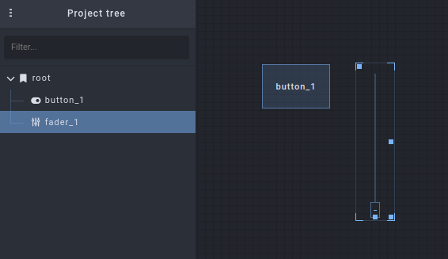
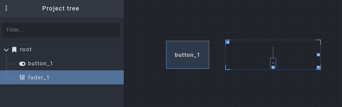
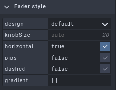
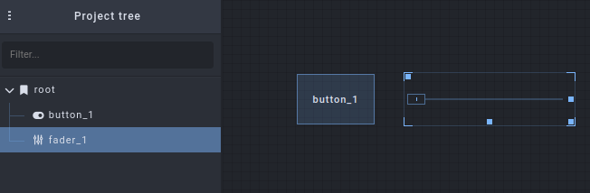

# First Steps with Open Stage Control

*Contributed by H. James Harkins, Feb. 2023*

Let's walk through the basic steps to build a simple interface in Open Stage Control, send information to another app, and deploy the interface to remote (even mobile) devices.

Before beginning, you should already have installed Open Stage Control -- see the [Introduction](https://openstagecontrol.ammd.net/docs/getting-started/introduction/).

Also: This document provides sample patches for SuperCollider, Pure Data and Max/MSP, to receive control data from the Open Stage Control interface. If you do not have any of these tools, I suggest to install [Pure Data](https://puredata.info/downloads/pure-data) because it has the smallest footprint.

## The Launcher

Use your system's application launcher, open the Open Stage Control app. Here, you can configure options for the interface server.

For now, go to the first box ("send") and type in `127.0.0.1:57120`. This will tell the server to send Open Sound Control messages to the same machine where the server is running, on port 57120.

NOTE: For your own applications, you can use any port that is not in use. For this example, I chose 57120 because it is SuperCollider's default UDP port (and I set the Pure Data and Max patches to use the same port, to simplify.)

You don't need to set any other options at this time.

### Addresses and ports

Many users approaching Open Sound Control for the first time get confused about ports. You need to be aware of the FROM and TO addresses. The "send" field in the Launcher should reference the address TO which messages should be sent. In this demo, we are assuming that Open Stage Control and the target app are running on the same machine. So the TO address is localhost: `127.0.0.1`. The "send" box should use the port *on which the target app is receiving messages*. This is typically under control of the target app: 1/ SuperCollider opens 57120 by default; 2/ Pd's [netreceive] object, and Max's [udpreceive], both require the TO port as an argument. So the TO port is your choice, as long as they match.

Open Stage Control sends messages FROM the IP address of the machine where Open Stage Control is running, and from port 8080 (or localhost = `127.0.0.1` if on the same machine). Thus, if the receiving app will filter incoming messages based on address, the filtering address should be the FROM address, port 8080. The target app can also update Open Stage Control's display by sending messages back to exactly this address. So you will see later, in the demo patches, that messages are sent to `127.0.0.1:8080` so that the user's interaction with the target app appears in Open Stage Control as well.

## Starting the server

Click the "play" button near the top left of the window. You should see status messages in the launcher window such as:

```
(INFO) Server started, app available at
    http://127.0.0.1:8080
    http://your.ip.ad.dress:8080
```

And a new, mostly empty, window will open. This new, larger window is the *client*.

## The client

The client allows you to edit and perform your interface.

The interface design is called a *session*. To create a new session, go to the "three-dots" menu at the top left, and choose Session > New session.

Two new panels are displayed: a project browser, and an object inspector (to set properties). The empty space in the middle is the editor, where you will build the interface.

Let's start with a toggle button. Right-click in the empty editor panel in the middle, and navigate to Add widget > Basics > button. For this demo, we don't need to change anything else: the button defaults to toggle behavior, and the display text is not important for now (although you can change it in the inspector, if you want).

And let's add one more control, to the right of this: Right-click, Add widget > Sliders > fader.



When a widget is selected, you can move it by dragging the top-left handle, and resize it by dragging the bottom-right handle. Let's use these handles to position the fader to the right of the button, and stretch it to be horizontal instead of vertical.



Notice, however, that the fader's value handle is still vertical. To fix this, look in the Inspector at the right, expand "Fader style," and check the "horizontal" checkbox.





By the way: I suggest to keep the widgets closer to the top left, so that they are still visible on a phone screen (later).

When designing an interface for production, you would change other object properties as well. In particular, the Open Sound Control addresses `/button_1` and `/fader_1` are not very descriptive. You would probably want to assign different command paths, in the "osc" tab. As this is just an introduction, we won't do that now.

## Receiving the data

At this time, the interface can already be used: three-dots menu > Editor > "Enabled" (click to disable the editor). (The controls will respond also when the editor is enabled, but you have to click an extra time to select the widget before changing its value.)

To see the effect, launch one of the following apps and open the given patch. The Open Stage Control button should open and close the envelope, and the fader should control frequency. The patches also send control data from their own GUIs back to Open Stage Control, so all of the controls should be synced in both directions.

NOTE: In Pure Data and Max, the default slider/fader range is 0-127, integers. Open Stage Control uses the range 0.0 - 1.0 by default. If you just create a slider and connect it, you won't see much action. In the example patches, the slider's properties have been modified to take a 0.0 - 1.0 floating-point range, matching the data from Open Stage Control.

NOTE: Because all of the patches bind to the same UDP port, you can open only one at a time. You could, if you like, change the port number in one patch, and add that port by specifying multiple "send" targets in the Launcher, e.g. `127.0.0.1:57120 127.0.0.1:7374`.

NOTE: These patches are provided as a courtesy to get you started more quickly. Maintaining, extending or developing them is outside the scope of the Open Stage Control community.

!!! Example "Choose your app"

    === "Pure Data"

        Copy the code below, and save it into a text file `osc-first-steps.pd`. Then open it in Pure Data.

        ```
        #N canvas 436 127 562 502 12;
        #X obj 86 51 loadbang;
        #X msg 86 76 \; pd dsp 1;
        #X obj 253 51 netreceive -u -b 57120;
        #X obj 253 76 oscparse;
        #X obj 253 101 list trim;
        #X obj 253 126 route fader_1 button_1;
        #X msg 253 190 4 \$1;
        #X obj 253 215 pow;
        #X obj 253 240 * 200;
        #X obj 253 265 lop~ 3;
        #X msg 328 265 \$1 100;
        #X obj 328 304 line~;
        #X obj 279 356 *~;
        #X obj 279 381 *~ 0.1;
        #X obj 266 424 dac~;
        #X text 38 139 Open Stage Control \; "First Steps" tutorial \; hjh
        2023;
        #X obj 253 304 osc~ 200;
        #X obj 328 159 tgl 15 0 empty empty empty 17 7 0 10 #fcfcfc #000000
        #000000 0 1;
        #X obj 256 159 hsl 60 15 0 1 0 0 empty empty empty -2 -8 0 10 #fcfcfc
        #000000 #000000 0 1;
        #X obj 70 251 unpack f s;
        #X obj 70 325 oscformat;
        #X msg 137 283 set \$1;
        #X obj 70 424 netsend -u -b;
        #X obj 93 356 loadbang;
        #X msg 93 381 connect 127.0.0.1 8080;
        #X obj 70 226 r sendback;
        #X msg 379 200 \; sendback \$1 button_1;
        #X msg 379 233 \; sendback \$1 fader_1;
        #X connect 0 0 1 0;
        #X connect 2 0 3 0;
        #X connect 3 0 4 0;
        #X connect 4 0 5 0;
        #X connect 5 0 18 0;
        #X connect 5 1 17 0;
        #X connect 6 0 7 0;
        #X connect 7 0 8 0;
        #X connect 8 0 9 0;
        #X connect 9 0 16 0;
        #X connect 10 0 11 0;
        #X connect 11 0 12 1;
        #X connect 12 0 13 0;
        #X connect 13 0 14 0;
        #X connect 13 0 14 1;
        #X connect 16 0 12 0;
        #X connect 17 0 10 0;
        #X connect 17 0 26 0;
        #X connect 18 0 6 0;
        #X connect 18 0 27 0;
        #X connect 19 0 20 0;
        #X connect 19 1 21 0;
        #X connect 20 0 22 0;
        #X connect 21 0 20 0;
        #X connect 23 0 24 0;
        #X connect 24 0 22 0;
        #X connect 25 0 19 0;
        ```

    === "Max/MSP"

        Copy the text below. In Max, choose File > New from clipboard.

        ```
        ----------begin_max5_patcher----------
        949.3oc0XkraaCCD8rCP9GHDxo.GWRJpEWzaEnW6gdrInfVlwgoxjBRTYEMe
        6khTx0HgVlwP1MFAwBZnjl2algyBe9zSFELS9.qJ.7YvOAiF8rVxHirFIi5D
        LJXI8grbZk4ACVxppnKXAiaWTwdPYV3SWSmyJ+EBbFZ0h74lkjyt8BDdkzBp
        J6FtXwuJYYJq1wwjIvw.LJt4RRh4F7DH3ptWRTujKxYJCJvqIUVq5Di5Dako
        drfY+7AAfqLK8mSOo4p9x3AfwypUJoXiTNtWFSBaHIJB1bIM5iDiEr603+sD
        tddQESLGfvZGj9ODHElBc5s8f5gnTqEHdKbG4l6vcleYxkKYB0aI32KXBvOT
        ZuM3qRgpTlCtL3a7xJkVJqn5x.fpVIK4zbvEfat8F.FhCW8cx4BVlrVX9XgN
        LK3DerKv0BLHoGNyRUNWuC1k6DG0GtsHEAM9wXCGvvsC6qykTkF3E0pdnC5e
        JtjtjozoXXB5rbSbNruv+t0p3OYjhlr6lFkbwhblSSCoOSCBkLIZksAS5988
        4R2Qa.uIP7pgeWxWt3BPVNO62.kDXABfVOmKcZe5MuOJzj3iDEYLSsUAfGtX
        d1SyoYu3D3vdi4mNIQiXhcKKIp622W5a3fmh97W.57xNSIOsO9jfab.gSmZH
        xfW+shuPPy2G0jN2oyCk5AYiwFZNs4liCx1TfwMeS7HKTaAWBb27t3sQ3wff
        YTwh8RuVmgzIQc2pQrGTGaqQEAOFZyJ6wr7M3lIauNbqWd3o5+ivZz14KNM7
        XNpNxcPMzCh21gX3wPL845p5vItnZpGL0NVHYvGRxzB5dwyR1vLgIdzHc693
        ihQBKj26hl9LufceaX3GNm5l3ZoVULvpy4X03+tL.djn11rKJhrECPnaCP3l
        8yia+e+bD.Zdv32w.QIHryjWgdTjxFBfR1sQ+eOw31uroFyqOpKC7ZV3UVhJ
        YcYV2Wr6vq.qgw4rJEWPUboX8mx9Pa1l6s9Zl21C88JTIKaFeu+wJ7GBDefP
        7dDAwGVadpWpCNX5KwG8EMXpyqHpzAScdE8fiFT8g1p9HCl9B8gejCbBgjMr
        aDcvxGfh2iPn4DL7HnB9w.Bn8TZQjeIplNXwdHuxTYfEZXTneY9SFNFR7lgC
        jBQdovgK+AB5kBcWMssCJZQwcrxp1WwpKcSi2JMg1ois2yE16ssnETxti28J
        1SpNfVp6IToaHrtz.wfGha6VNXoTuQQTy61t1v1FUa5KUP0SaUPs7xz+5omn
        ef+B9C+QQC
        -----------end_max5_patcher-----------
        ```

    === "SuperCollider"

        Copy/paste the code below into a new code document. Run the entire block to start. It will clean up when you close the GUI window.

        ```
        // OSC response part
        (
        var addr = NetAddr("127.0.0.1", 8080);  // FROM address
        var freqRange = ControlSpec(200.0, 800.0, \exp);
        var button, slider;

        OSCdef(\button, { |msg|
        	defer { button.value = msg[1] };
        	if(x.notNil) { x.set(\gate, msg[1]) };
        }, '/button_1', addr);

        OSCdef(\slider, { |msg|
        	defer { slider.value = msg[1] };
        	if(x.notNil) { x.set(\freq, freqRange.map(msg[1])) };
        }, '/fader_1', addr);

        w = Window("Open Stage Control", Rect(800, 200, 400, 100)).front;
        w.layout = HLayout(
        	button = Button(),
        	slider = Slider().orientation_(\horizontal)
        );
        w.alwaysOnTop = true;  // may not take effect in all window managers

        button.states = [["off"], ["playing", Color.black, Color(0.7, 1, 0.7)]];
        button.action = { |view|
        	if(x.notNil) { x.set(\gate, view.value) };
        	addr.sendMsg('/button_1', view.value);
        };

        slider.action = { |view|
        	if(x.notNil) { x.set(\freq, freqRange.map(view.value)) };
        	addr.sendMsg('/fader_1', view.value);
        };

        w.onClose = {
        	if(x.notNil) { x.free };
        	OSCdef(\button).free;
        	OSCdef(\slider).free;
        };

        // audio part
        // if this fails (if you have an issue with audio devices),
        // you won't hear anything but the onscreen GUIs
        // will reflect changes from Open Stage Control
        s.waitForBoot {
        	x = { |freq = 200, amp = 0.1, gate = 0|
        		var eg = EnvGen.kr(Env.asr(0.1, 1, 0.1), gate);
        		(SinOsc.ar(Lag.kr(freq, 0.1)) * amp * eg).dup
        	}.play;
        };
        )
        ```

## Deploying the interface

The whole point of Open Stage Control is to make the interface available on other devices, especially mobile devices.

The interface will not be visible to other clients, however, until you save it to disk: three-dots menu > Session > Save, and give the file a name such as `open-stage-demo` (you don't need to type the `.json` extension).

Now -- remember those status messages in the launcher window? On another device (computer, phone or tablet), go to the `http://192.168.xxx.yyy:8080` address. The device should be on the same (W)LAN. (If there is another remote address, it may or may not work, depending on your network.) Supported browsers are Firefox v. 75 and higher, or Chromium/Chrome v. 60 and higher.

This should open an empty client window, similar to the one you saw before.

From here, you can open the session that you just saved: three-dots menu *in the webpage* > Session > Open Recent (yes, this is synced from the server!). This should display the controls created in that session, and the controls should function the same as in the other client window.

And that is... it! Basic usage is as simple as that.

For convenience, if there is a session you know that you will use often, and you don't want to load it in the webpage by hand every time, you can choose the file under "load" in the initial Launcher window. This is also useful for public deployments with audience participation, where you don't want audience members to have to load manually.

When not using Open Stage Control, you can also stop the server from the launcher window (stop button, top-left).
