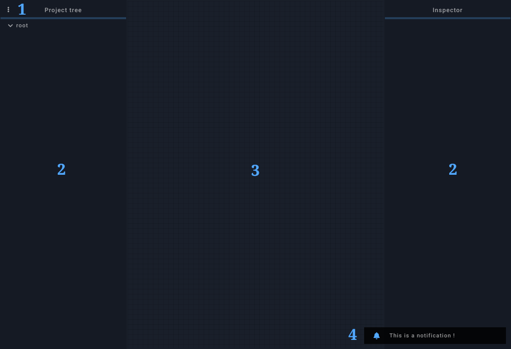
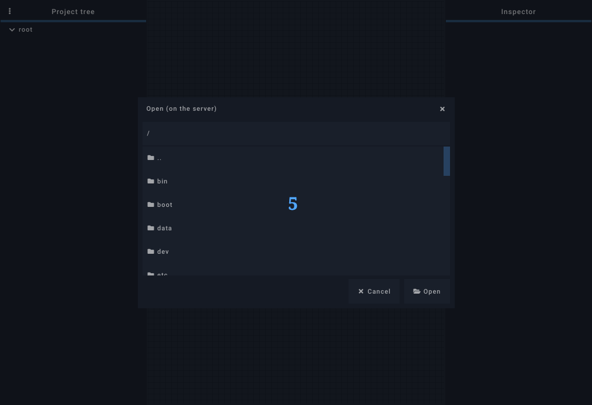

## 1. Menu

- Session
    - New session: create a new empty session and enable the editor
    - Open: browse session files on the server
    - Open recent: open a recent session on the server
    - Save / Save as: save session file on the server
    - Import: import a session file from the client's filesystem
    - Export: export a session file to the client's filesystem
- State
    - Store: save all widgets' state to a persistent slot (stored in the client's cache)
    - Recall: apply state storer in the persistent slot (updated widgets may send messages)
    - Send All: make all widgets send their current value
    - Open: browse state files on the server
    - Save / Save as: save state file on the server
    - Import: import a state file from the client's filesystem
    - Export: export a state file to the client's filesystem
- Editor
    - Enable: togggle editor's state
    - Grid: toggle grid
    - Project tree: toggle project tree's visibility
    - Inspector: toggle inspector's visibility
    - Relative units (%): when enabled, newly created widgets will have their position and size set in percents.
- Fullscreen: toggle fullscreen
- Prevent sleep (mobile only): attempt to prevent device from going to sleep when idle

## 2. Sidepanels

The sidepanels are only visible when the editor is active, they can be resized and/or hidden. Both are describe in the [editor](./editor.md) section.

## 3. Session

It is the main component, it contains all the widgets and takes all the available space when the sidepanels are closed.

## 4. Notifications

Notifications appear in the lower right corner, they are usually used to convey server status informations.

## 5. Modals

Modals are virtual popup windows that may contain various content: file browser, color picker, error, widgets...  

## Keyboard shortcuts

=== "Linux / Windows"

    | Shortcut | Description |
    |---|---|
    | ++ctrl+e++ | enable/disable editor |
    | ++ctrl+s++ | save session |
    | ++ctrl+shift+s++ | save session as... |
    | ++ctrl+o++ | open a session file |
    | ++ctrl+w++ | close client |

=== "Mac"

    | Shortcut | Description |
    |---|---|
    | ++cmd+e++ | enable/disable editor |
    | ++cmd+s++ | save session |
    | ++cmd+shift+s++ | save session as... |
    | ++cmd+o++ | open a session file |
    | ++cmd+w++ | close client |
