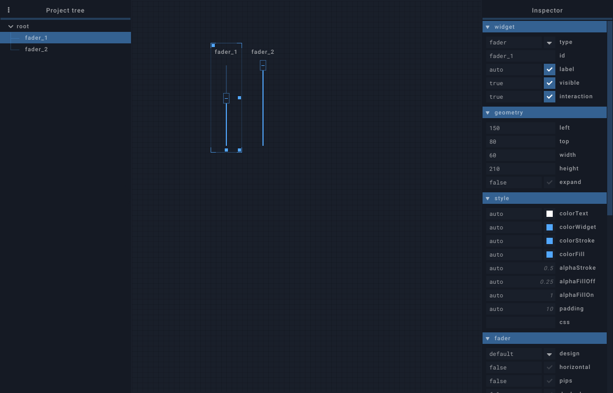

## Widget selection

Clicking on a widget, on a tab label or on an item in the project tree selects the widgets for edition:

- All its editable properties are shown in the inspector panel
- The corresponding item in the project tree is highlighted
- A selection outline is drawn around the widget
- Dragging / Resizing handles are added to the widget

## Menu

Right clicking on a widget displays a menu with the following actions

- `Show in tree`: show widget in project tree (hidden when clicking in the project tree)
- `Position`:
    - `Send to back`: Send selected widget to back (first of siblings)
    - `Send farther`: Send selected widget farther
    - `Bring closer`: Bring selected widget closer
    - `Bring to front`: Bring selected widget to front (last of siblings)
- `Copy`: copy widget's data
- `Cut`: copy widget's data and delete selected widget
- `Paste`: paste copied widget in selected container
    - `Paste`: paste the widget as is
    - `ID + 1` : increments the id of the copied widget (and all its children) before pasting
    - `Clone` : create a clone widget targetting the copied widget
- `Add widget`: create a new widget in selected container
- `Add tab`: create a new tab in selected container
- `Delete`: delete selected tab or widget

## Inspector

Selected widget's properties are displayed and can be modified in the inspector. The [properties reference](../widgets/properties-reference.md) lists the available properties for each widget type.

- Property fields are all multiline (press `shift + enter` for new line).
- Properties are written in JSON, with some flexibility brought by the [JSON5](https://github.com/json5/json5) format. For example, doubles quotes around object keys are not mandatory.
- Clicking on a property name spawns a help modal window

## Project tree

The project tree displays the whole widget structure of the session. Widgets can be reordered within a container with drag-and-drop.

## Widget resizing / dragging

Selected widget can be resized using its south, south-east and east handles. It can be dragged with its north-west handle (holding ++alt++ extends this handle to the widget's size to ease dragging). If the widget's position/size was written in percents, the editor will try to keep using percents.

When the grid is enabled, widget resizing / dragging snaps to a 10 pixel wide grid.

## Multi-widgets editing

Multiple widgets can be edited at once.

- The inspector will only display properties that are shared by all selected widgets
- Selection can only contain sibling widgets (same direct parent)
- Context-menu actions and properties changes apply to all selected widgets
- Resizing / Dragging will affect all selected widgets, relatively the selection's size and position

## Keyboard shortcuts

=== "Linux / Windows"

    | Shortcut | Description |
    |---|---|
    | ++ctrl+g++ | Toggle grid. |
    | ++ctrl+t++ | Toggle session tree. |
    | ++ctrl+i++ | Toggle inspector. |
    | ++"Click"++ | Widget selection. |
    | ++ctrl+"Click"++ | Multi-widget selection. Widgets can be toggled from selection by clicking on them individually.|
    | ++shift+"Click"+"Drag"++ | Draw a selection rectangle and attempt to select widgets in it (starts by selecting the widget under the cursor). If ++ctrl++ is pressed too, current selection is kept and will be merged with the new one if possible. |
    | ++ctrl+z++ | Undo |
    | ++ctrl+y++  ++ctrl+shift+z++ | Redo |
    | ++delete++ | Delete selected widgets |
    | ++ctrl+c++ | Copy selected widgets |
    | ++ctrl+x++ | Cut selected widgets |
    | ++ctrl+v++ | Paste clipboard in selected widget |
    | ++ctrl+shift+v++ | Paste and increment id |
    | ++up++  ++down++  ++left++  ++right++ | Move selected widgets (1 grid unit, hold ++shift++ for 5 grid units) |
    | ++alt+up++  ++alt+down++  ++alt+left++  ++alt+right++ | Resize selected widgets (1 grid unit, hold ++shift++ for 5 grid units) |
    | ++ctrl+a++ | Select current widget's siblings and itself |
    | ++ctrl+shift+a++ | Cancel current widget selection |
    | ++ctrl+up++ | Select current widget's parent |
    | ++ctrl+down++ | Select current widget's first child |
    | ++ctrl+right++ | Select current widget's next sibling |
    | ++ctrl+left++ | Select current widget's previous sibling |
    | ++t++ | Show selected widget in the project tree |
    | ++Home++ | Send selected widget to back |
    | ++Page Up++ | Send selected widget farther |
    | ++Page Down++ | Bring selected widget closer |
    | ++End++ | Bring selected widget to front |

=== "Mac"

    | Shortcut | Description |
    |---|---|
    | ++cmd+g++ | Toggle grid. |
    | ++cmd+t++ | Toggle session tree. |
    | ++cmd+i++ | Toggle inspector. |
    | ++"Click"++ | Widget selection. |
    | ++cmd+"Click"++ | Multi-widget selection. Widgets can be toggled from selection by clicking on them individually.|
    | ++shift+"Click"+"Drag"++ | Draw a selection rectangle and attempt to select widgets in it (starts by selecting the widget under the cursor). If ++cmd++ is pressed too, current selection is kept and will be merged with the new one if possible. |
    | ++cmd+z++ | Undo |
    | ++cmd+y++  ++cmd+shift+z++ | Redo |
    | ++backspace++ | Delete selected widgets |
    | ++cmd+c++ | Copy selected widgets |
    | ++cmd+x++ | Cut selected widgets |
    | ++cmd+v++ | Paste clipboard in selected widget |
    | ++cmd+shift+v++ | Paste and increment id |
    | ++up++  ++down++  ++left++  ++right++ | Move selected widgets (1 grid unit, hold ++shift++ for 5 grid units) |
    | ++alt+up++  ++alt+down++  ++alt+left++  ++alt+right++ | Resize selected widgets (1 grid unit, hold ++shift++ for 5 grid units) |
    | ++cmd+a++ | Select current widget's siblings and itself |
    | ++cmd+shift+a++ | Cancel current widget selection |
    | ++cmd+up++ | Select current widget's parent |
    | ++cmd+down++ | Select current widget's first child |
    | ++cmd+right++ | Select current widget's next sibling |
    | ++cmd+left++ | Select current widget's previous sibling |
    | ++t++ | Show selected widget in the project tree |
    | ++Home++ | Send selected widget to back |
    | ++Page Up++ | Send selected widget farther |
    | ++Page Down++ | Bring selected widget closer |
    | ++End++ | Bring selected widget to front |
