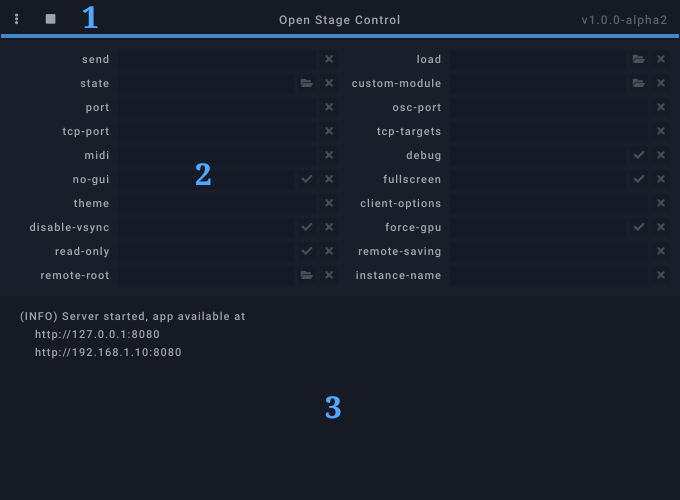

## 1. Menu

- Start: start the server (hidden when started)
- Stop: stop the server (hidden when stopped)
- New window: open a new client window (hidden when stopped)
- Load: load server configuration from file
- Save / Save as: save server configuration to file
- List MIDI devices: list available MIDI devices in the console
- Console:
    - Clear: clear console
    - Autoscroll: enable/disable console autoscroll
    - Check for update at startup: enable/disable this feature
- Autostart: start the server automatically when launcher is started
- Always on top: pin the launcher window above other the windows

The "play/stop" icon can be used to start and stop the server without opening the menu.

## 2. Configuration form

Each server option is displayed here. When clicking on an option's label, a short help will be printed in the console. When an option is not correctly set, its label will turn to orange and an error message will be printed in the console.

## 3. Console

The console displays various information, runtime errors and server debug messages.

## Keyboard shortcuts

=== "Linux"

    | Shortcut | Description |
    |---|---|
    | ++f5++ | start server |
    | ++f6++ | stop server |
    | ++ctrl+n++ | open new client window |
    | ++ctrl+o++ | load settings |
    | ++ctrl+s++ | save settings |
    | ++ctrl+shift+s++ | save settings as... |
    | ++ctrl+m++ | list midi devices |
    | ++ctrl+l++ | clear console |
    | ++ctrl+w++ | close window |

=== "Windows"

    | Shortcut | Description |
    |---|---|
    | ++f5++ | start server |
    | ++f6++ | stop server |
    | ++ctrl+n++ | open new client window |
    | ++ctrl+o++ | load settings |
    | ++ctrl+s++ | save settings |
    | ++ctrl+shift+s++ | save settings as... |
    | ++ctrl+m++ | list midi devices |
    | ++ctrl+l++ | clear console |
    | ++alt+f4++ | close window |

=== "Mac"

    | Shortcut | Description |
    |---|---|
    | ++f5++ | start server |
    | ++f6++ | stop server |
    | ++cmd+n++ | open new client window |
    | ++cmd+o++ | load settings |
    | ++cmd+s++ | save settings |
    | ++cmd+shift+s++ | save settings as... |
    | ++cmd+m++ | list midi devices |
    | ++cmd+l++ | clear console |
    | ++cmd+w++ | close window |
    | ++cmd+q++ | quit app |
